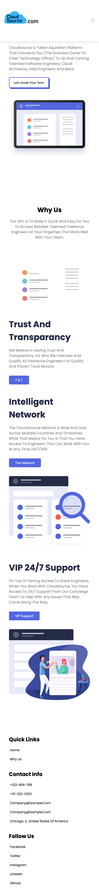
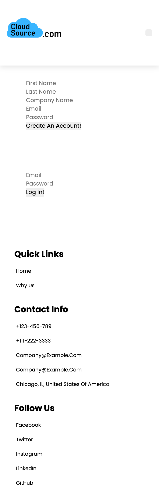
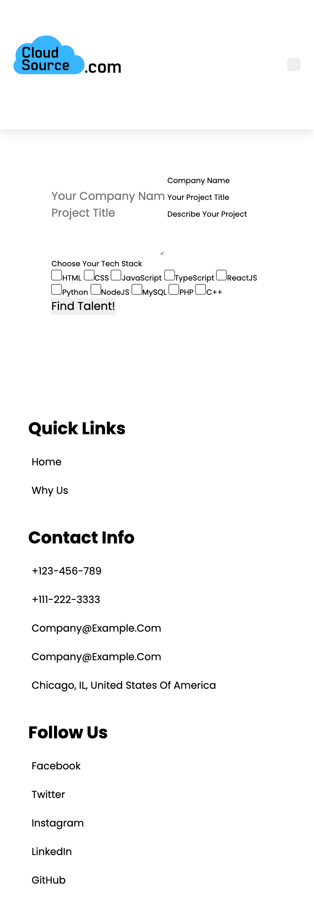

# CloudSource Talent Network

# Team Generator

## Repository & Video Walkthrough

Video Walkthrough Command Line: 

Video Walkthrough of HTML Output: 

[Repository](https://github.com/)
[Deployed App]()

## Directory

1. [User Story](#user-story)
2. [Installation](#installation)
3. [Application Preview](#application_preview)
4. [Technology](#technology)
5. [License](#license)
6. [About](#about)

## User Story
```md
AS A business owner or Director of Technology
I WANT to find tech talent that is reliable and knowledgeable
SO THAT I can hire for a freelance or short term project.
```
```md
GIVEN I go on the CloudSource website, I am able to see the
information about the company and it's initiative
WHEN I click on the LOG IN button
THEN I am taken to a SIGN-UP and LOG-IN page.
WHEN I fill out the information to SIGN-UP
THEN I am taken to the profile page where I can have access to make a request for a project.
WHEN I click the checkboxes for the desired developer that I need
THEN the database from CloudSource spits out the information that matches the description requested by USER.

```
## Installation


## Application Preview
Full Preview (Mobile Version)


Sign-Up/Log-In


Project Profile


## Technology

Prerequsites:
- [Node.js](https://nodejs.org/en/)
- [JavaScript](https://developer.mozilla.org/en-US/docs/Web/JavaScript)

Additional Packages unique to this application:
- [Inquirer](https://www.npmjs.com/package/inquirer)

## License

MIT License

Copyright (c) 2021

Permission is hereby granted, free of charge, to any person obtaining a copy
of this software and associated documentation files (the "Software"), to deal
in the Software without restriction, including without limitation the rights
to use, copy, modify, merge, publish, distribute, sublicense, and/or sell
copies of the Software, and to permit persons to whom the Software is
furnished to do so, subject to the following conditions:

The above copyright notice and this permission notice shall be included in all
copies or substantial portions of the Software.

THE SOFTWARE IS PROVIDED "AS IS", WITHOUT WARRANTY OF ANY KIND, EXPRESS OR
IMPLIED, INCLUDING BUT NOT LIMITED TO THE WARRANTIES OF MERCHANTABILITY,
FITNESS FOR A PARTICULAR PURPOSE AND NONINFRINGEMENT. IN NO EVENT SHALL THE
AUTHORS OR COPYRIGHT HOLDERS BE LIABLE FOR ANY CLAIM, DAMAGES OR OTHER
LIABILITY, WHETHER IN AN ACTION OF CONTRACT, TORT OR OTHERWISE, ARISING FROM,
OUT OF OR IN CONNECTION WITH THE SOFTWARE OR THE USE OR OTHER DEALINGS IN THE
SOFTWARE.

## About
Eduard Voicu
- [GitHub](https://github.com/eduardvoicu)
- [LinkedIn](https://www.linkedin.com/in/eduardvoicu/)

Nick
- [GitHub](https://github.com/nlaramee120)
- [LinkedIn](https://www.linkedin.com/in/nick-laramee-90386520b/)

Elliot
- [GitHub](https://github.com/elliottdombrowski)
- [LinkedIn](https://www.linkedin.com/in/elliott-dombrowski-8b2ba8211/)